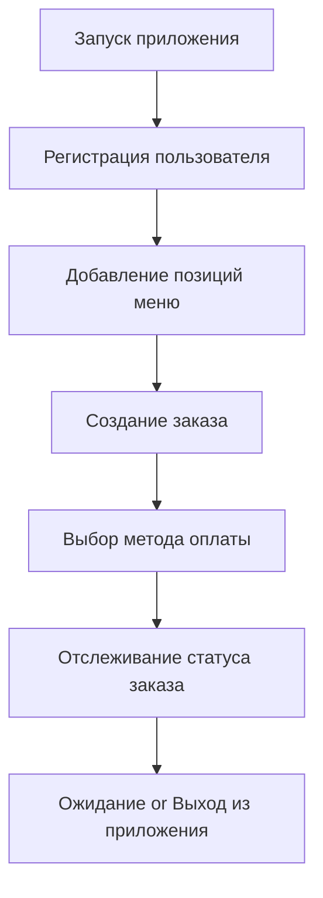
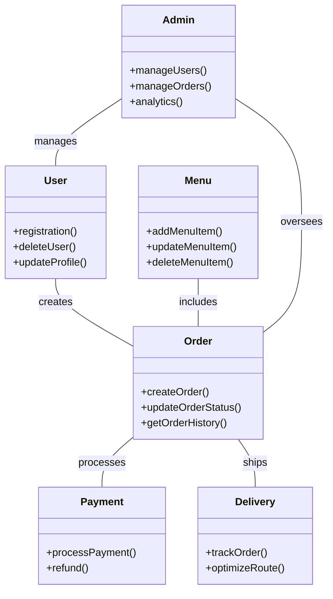
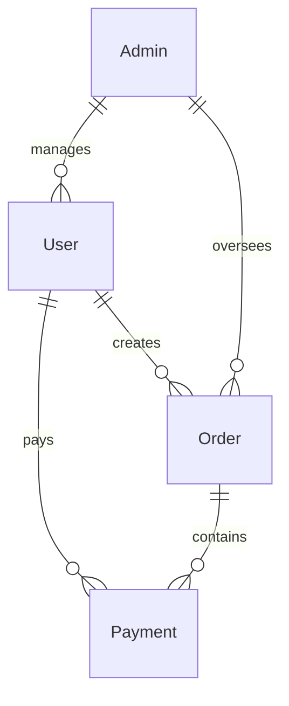

***Доставка еды DoDo pizza***
========================

Причина разработки: 
-
Во время креативной задумки проекта мне пришла идея на счет доставки еды, задумка связанная с недавно нашумевшим внедрением доставки "Самокат" в наш город, это меня вдохновило. Т к люди им востребованно пользуются. Так получается, что доставки ресторанчиков и кафе способны существенно расширить аудиторию, увеличить количество проданных блюд и выручку. Доставка еды даёт бизнесу новые возможности. 
-------------------------

Огромные стремления, планы, масштабы разработки данного проекта:  
1) Развитие бренда  
2) Привлечение новых клиентов  
3) Создание клиентской базы и индивидуальных программ лояльности  
4) Завоевание доли рынка доставки  
5) Удержание постоянных клиентов, которые хотят заказывать любимую еду, находясь дома или на работе  
6) От счастья выйти на мировой рынок  

Возлагающие требование входе разработки проекта  
1. База данных:  
     - Пользователи  
     - Регистрация пользователя  
     - Вход в аккаунт  
     - Выход из аккаунта  
     - Изменение данных пользователя в профиле
        ! имя
        !  адрес
        !  телефон
     - Меню  
        -  Добавление позиций меню
        -  название
        -  описание
        -  цена
        -  категория  
     - Изменение позиций меню  
     - Удаление позиций меню 
     - Заказы  
     - Создание заказа
        -  пользователь
        -  список товаров
        -  сумма  
     - Изменение статуса заказа
        -  в обраотке
        -  доставлен
        -  отменён  
        -  История заказов пользователя  

2. Интерфейс пользователя  
     - Главная страница  
     - Отображение меню  
     - Поиск по меню
     - Страница заказа  
     - Выбор товаров  
     - Корзина
        -  изменение количества
        -  удаление товара  
     - Личный кабинет  
     - Просмотр профиля  
     - История заказов  

3. Система оплаты  
     - Методы оплаты
        -  система СПБ
        -  Кредитная карта  
        -  Электронные кошельки  
     - Обработка транзакций  
     - Подтверждение оплаты  
     - Возврат средств  

4. Логистика доставки  
     - Система отслеживания  
     - Отслеживание статуса заказа в реальном времени  
     - Уведомления о статусе доставки  
     - Маршрутизация  
     - Оптимизация маршрутов для курьеров  
     - Расчёт времени доставки  

5. Административная панель  
     - Управление пользователями  
     - Просмотр списка пользователей  
     - Блокировка/разблокировка пользователей  
     - Управление заказами  
     - Просмотр всех заказов  
     - Изменение статуса заказа  
     - Аналитика  
     - Статистика по продажам  
     - Анализ популярности блюд  

6. Безопасность  
     - Авторизация и аутентификация  
     - Регистрация и вход в систему  
     - Восстановление пароля  
     - Шифрование данных  
     - Защита личной информации пользователей  
     - Защита данных транзакций  

7. Поддержка пользователей  
     - Чат поддержки (саппорт)
     - Call центр с оператором
     - Онлайн-чат с оператором 
     - Часто задаваемые вопросы (FAQ)  
     - Обратная связь  
     - Оставить отзыв о доставке  
     - Предложения по улучшению сервиса  

8. Маркетинг и акции  
     - Промокоды
        -  от лица самой компании
        -  от людей, с которыми сотрудничает компания по договору (медийная личность):
            - стримеры (twich, youtube, kick, vk video)
            - блогеры
            - гении миллиардеры плей бой филантропы  
     - Создание и управление промокодами  
     - Применение промокодов при заказе  
     - Лояльность клиентов  
     - Система накопительных баллов  
     - Специальные предложения
        -  Постоянным клиентам
        -  Новым клиентам
        -  Акции дня
        -  Горячие новинки (то что вышло недавно)

1) Диаграмма активность

2) Диаграмма классов.

3) Диаграмма сценария.

