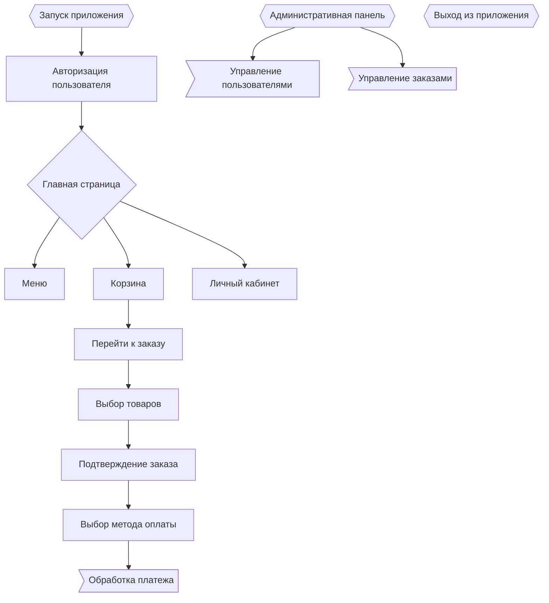
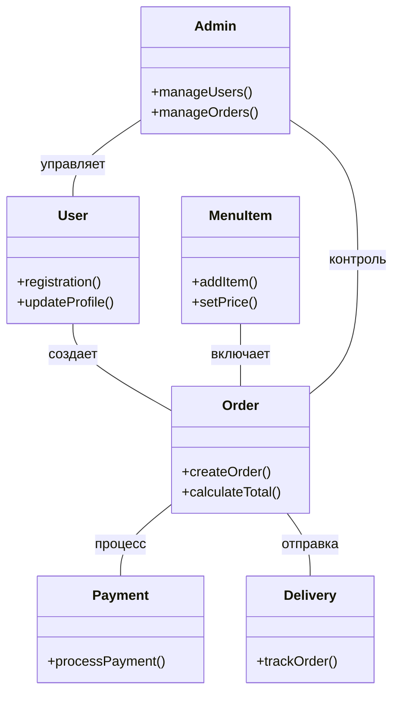
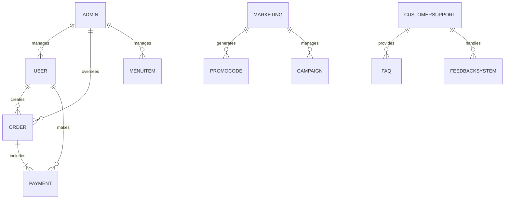

🟠Доставка еды франшизы "DoDo pizza"🟠
==================

  

-----------------

Причина разработки ✅️
----------
Во время креативной задумки над темой проекта я очень хотел поесть пиццы, и вдруг меня осенила идея насчет доставки. Задумка связана с недавним внедрением нашумевшего сервиса доставки продуктов "Самокат" в наш город. Это меня вдохновило. Так как люди активно пользуются этой услугой, им банально лень готовить, а доставка упрощает жизнь: заказал себе поесть ⟶ тебе привезли заказ ⟶ ты поел ⟶ ты рад и доволен жизнью 😎👌🔥. Таким образом, доставка от ресторанов и кафе способна существенно расширить аудиторию, увеличить количество проданных блюд и выручку. Доставка еды даёт бизнесу новые возможности.

---------------------
Огромные стремления, планы, масштабы разработки данного проекта ❗️
1) Развитие бренда  
2) Привлечение новых клиентов  
3) Создание клиентской базы и индивидуальных программ лояльности  
4) Завоевание доли рынка доставки  
5) Удержание постоянных клиентов, которые хотят заказывать любимую еду, находясь дома или на работе  
6) От счастья выйти на мировой рынок  
-------------------------
Возлагающие требование входе разработки проекта 📝
1. База данных:  
     - Пользователи  
     - Регистрация пользователя  
     - Вход в аккаунт  
     - Выход из аккаунта  
     - Изменение данных пользователя в профиле
        - имя
        - адрес
        - телефон
     - Меню  
        - Добавление позиций меню
        - название
        - описание
        - цена
        - категория  
     - Изменение позиций меню  
     - Удаление позиций меню 
     - Заказы  
     - Создание заказа
        - пользователь
        - список товаров
        - сумма  
     - Изменение статуса заказа
        - в обраотке
        - доставлен
        - отменён  
        - История заказов пользователя  

2. Интерфейс пользователя  
     - Главная страница  
     - Отображение меню  
     - Поиск по меню
     - Страница заказа  
     - Выбор товаров  
     - Корзина
        - изменение количества
        - удаление товара  
     - Личный кабинет  
     - Просмотр профиля  
     - История заказов  

3. Система оплаты  
     - Методы оплаты
        - система СПБ
        - Кредитная карта  
        - Электронные кошельки  
     - Обработка транзакций  
     - Подтверждение оплаты  
     - Возврат средств  

4. Логистика доставки  
     - Система отслеживания  
     - Отслеживание статуса заказа в реальном времени  
     - Уведомления о статусе доставки  
     - Маршрутизация  
     - Оптимизация маршрутов для курьеров  
     - Расчёт времени доставки  

5. Административная панель  
     - Управление пользователями  
     - Просмотр списка пользователей  
     - Блокировка/разблокировка пользователей  
     - Управление заказами  
     - Просмотр всех заказов  
     - Изменение статуса заказа  
     - Аналитика  
     - Статистика по продажам  
     - Анализ популярности блюд  

6. Безопасность  
     - Авторизация и аутентификация  
     - Регистрация и вход в систему  
     - Восстановление пароля  
     - Шифрование данных  
     - Защита личной информации пользователей  
     - Защита данных транзакций  

7. Поддержка пользователей  
     - Чат поддержки (саппорт)
     - Call центр с оператором
     - Онлайн-чат с оператором 
     - Часто задаваемые вопросы (FAQ)  
     - Обратная связь  
     - Оставить отзыв о доставке  
     - Предложения по улучшению сервиса  

8. Маркетинг и акции  
     - Промокоды
        - от лица самой компании
        - от людей, с которыми сотрудничает компания по договору (медийная личность):
            - стримеры (twich, youtube, kick, vk video)
            - блогеры
            - гении миллиардеры плей бой филантропы  
     - Создание и управление промокодами  
     - Применение промокодов при заказе  
     - Лояльность клиентов  
     - Система накопительных баллов  
     - Специальные предложения
        - Постоянным клиентам
        - Новым клиентам
        - Акции дня
        - Горячие новинки (то что вышло недавно)
-------------------------

Диаграмма активность 💡
   
Пояснение:
1. Запуск приложения
2. Авторизация пользователя
3. Главная страница после авторизации
4. Меню, Корзина и Личный кабинет
5. Процесс заказа
6. Административная панель - интерфейс, доступный только администраторам приложения. Через эту панель администраторы могут выполнять действия
7. Выход из приложения (пользоваетель в любой момент может выйти из приложения)
   

-------------------------

Диаграмма классов 🟣

Пояснение:
1. Пользователь создает заказ
2. Элементы меню включаются в заказ
3. Заказ обрабатывает платеж
4. Заказ отправляется на доставку
5. Администратор управляет пользователями и следит за заказами

-------------------------

Диаграмма сценария 🔵 

Пояснение:  
Диаграмма показывает, как разные роли в системе взаимодействуют друг с другом, чтобы обеспечить работу сервиса от создания заказов до управления пользователями и поддержки клиентов  

