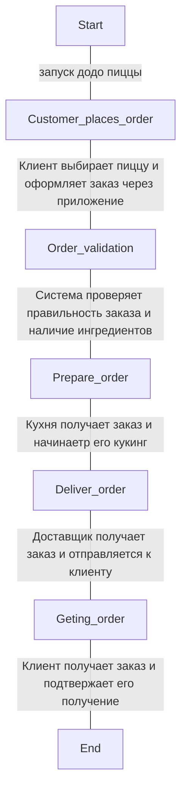
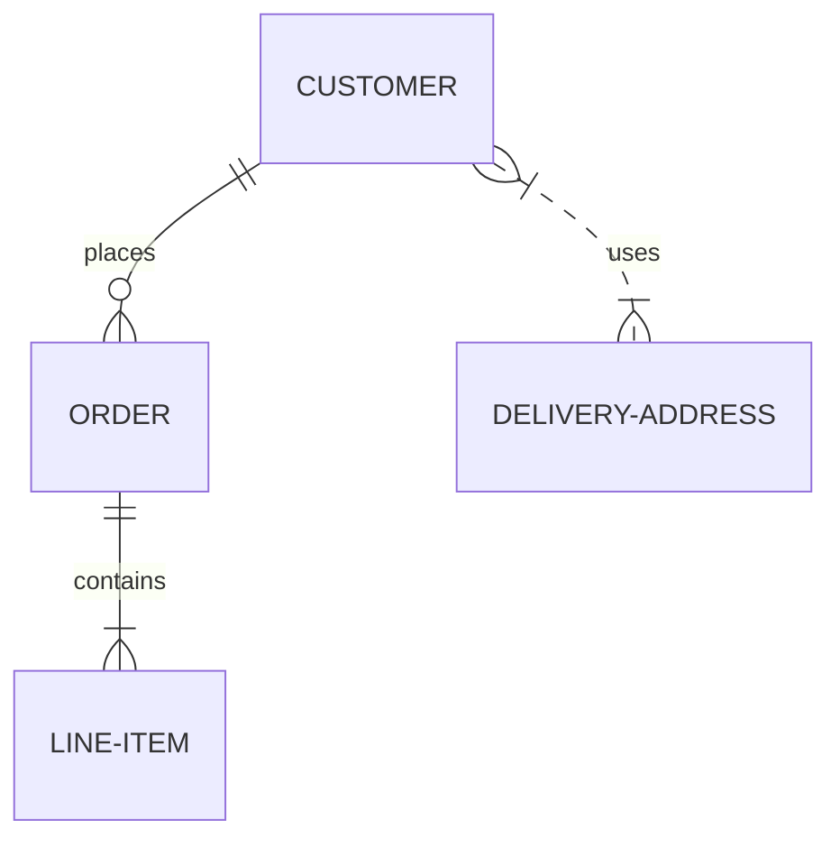

Доставка еды DoDo pizza
1) Диаграмма последовательности.

```mermaid
flowchart TD
    Start-- запуск додо пиццы ---Customer_places_order-- Клиент выбирает пиццу и оформляет заказ через приложение --- Order_validation-- Система проверяет правильность заказа и наличие ингредиентов --- Prepare_order-- Кухня получает заказ и начинаетр его кукинг --- Deliver_order-- Доставщик получает заказ и отправляется к клиенту --- Geting_order -- Клиент получает заказ и подтвержает его получение --- End
```
2) Диаграмма сценария.

```mermaid
erDiagram
    CUSTOMER ||--o{ ORDER : places
    ORDER ||--|{ LINE-ITEM : contains
    CUSTOMER }|..|{ DELIVERY-ADDRESS : uses
```
